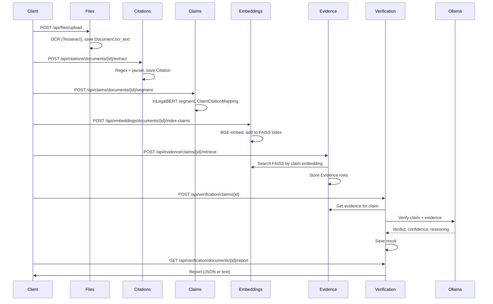

# ADAL Backend Codebase Overview

This plan summarizes the backend structure, endpoints, RAG flow, and technology so you can navigate and extend the codebase. No code changes are proposed.

---

## 1. What ADAL Is

**ADAL (AI-Driven Analysis for Law)** is a legal intelligence platform for Pakistani law. It:

- Ingests legal documents (PDF, images, text), runs OCR, and stores extracted text.
- Detects **citations** (PLD, SCMR, PPC, etc.) and segments **claims** with InLegalBERT.
- Uses **RAG**: embeds text with BGE, stores vectors in FAISS, retrieves evidence for claims, then uses an **LLM (Ollama)** to verify claims and produce **verification reports**.

So the "RAG stuff" is: **upload doc → citations → claims → embed & index → retrieve evidence → LLM verification → report**.

---

## 2. Technology Stack

| Layer | Technology |
|-------|------------|
| **API** | FastAPI 0.121, Uvicorn, Starlette |
| **Database** | PostgreSQL (Local + optional Supabase + optional Neon), SQLAlchemy 2.0 |
| **Auth** | JWT (python-jose), bcrypt, optional Supabase users |
| **OCR** | Tesseract (pytesseract), pdf2image, Pillow |
| **NLP / RAG** | **InLegalBERT** (law-ai/InLegalBERT) for claim segmentation; **BGE** (BAAI/bge-base-en-v1.5) for embeddings; **FAISS** (faiss-cpu) for vector search |
| **LLM** | Ollama (local, e.g. llama2) via `requests`; used for claim verification |
| **Cache** | Redis (optional; backend runs without it) |
| **Runtime** | Python 3.x; Pydantic 2, httpx, requests |

Key deps in [adal-backend/requirements.txt](adal-backend/requirements.txt): `fastapi`, `uvicorn`, `sqlalchemy`, `psycopg2-binary`, `transformers`, `torch`, `sentence-transformers`, `faiss-cpu`, `pytesseract`, `pdf2image`, `redis`, `supabase`, `python-jose`, `bcrypt`.

---

## 3. Backend Directory Structure

```
adal-backend/
├── app/
│   ├── main.py                 # FastAPI app, lifespan, CORS, rate limit, router registration
│   ├── core/                   # Security and shared clients
│   │   ├── redis_client.py      # Redis connection (optional cache)
│   │   └── security.py         # JWT, password hashing, token helpers
│   ├── database/
│   │   ├── database_main.py    # Backward compat: re-exports Local DB as default
│   │   ├── database_manager.py # Multi-DB: Local PG, Supabase, Neon engines/sessions
│   │   ├── schemas.py          # Pydantic request/response schemas (if any here)
│   │   ├── local_schema.sql    # Reference SQL for local PostgreSQL
│   │   └── SUPABASE_SCHEMA_REFERENCE.sql
│   ├── middleware/
│   │   └── rate_limit.py       # Rate limiting (e.g. login) per IP
│   ├── models/                 # SQLAlchemy ORM models (tables)
│   │   ├── auth_models.py      # User (and any auth-related tables)
│   │   ├── citation_model.py   # Citation
│   │   ├── claim_model.py      # Claim, ClaimCitationMapping
│   │   ├── document_model.py   # Document
│   │   ├── embedding_model.py  # Embedding (optional metadata)
│   │   ├── evidence_model.py   # Evidence
│   │   ├── user_model.py       # User (if separate from auth)
│   │   └── verification_report_model.py  # VerificationReport
│   ├── routes/                 # API route handlers (thin; call services)
│   │   ├── auth_routes.py      # Auth: register, login, refresh, profile, logout, password reset
│   │   ├── file_router.py     # Files: upload, list, get, extract-text, download, delete
│   │   ├── citation_router.py  # Citations: extract, get by doc/id, delete
│   │   ├── claim_router.py     # Claims: segment, list, get by doc/id, delete, claim-citations
│   │   ├── embedding_router.py# Embeddings: generate, batch, index-claims, search, index stats
│   │   ├── evidence_router.py # Evidence: retrieve by claim/doc, get, delete
│   │   ├── verification_router.py # Verification: verify claim/doc, get report, export
│   │   ├── summary_router.py   # Summary: generate summary (e.g. LLM)
│   │   ├── admin_router.py    # Admin: delete documents/users/claims/evidence/citations
│   │   ├── health_router.py   # Health: /health, DB, live, ready, redis
│   │   ├── user_router.py     # User stub
│   │   └── cases_router.py    # Cases stub (not mounted in main)
│   ├── services/               # Business logic (called by routes)
│   │   ├── auth_service.py
│   │   ├── file_service.py     # Upload, OCR, text extraction, storage
│   │   ├── citation_service.py# Citation detection (regex/patterns), parsing
│   │   ├── claim_service.py   # InLegalBERT load, claim segmentation, claim–citation mapping
│   │   ├── embedding_service.py # BGE embeddings
│   │   ├── retrieval_service.py  # FAISS index management, similarity search
│   │   ├── evidence_service.py   # Retrieve evidence for claims, store Evidence
│   │   ├── verification_service.py # Orchestrate evidence + LLM verification
│   │   ├── llm_service.py      # Ollama API calls for verification
│   │   └── report_service.py   # Build verification report (JSON/text)
│   └── utils/
│       ├── cache_decorator.py  # Redis-backed cache decorator
│       └── database_helpers.py # DB helpers
├── data/                       # FAISS indices, uploads, OCR output (paths from config)
├── migrations/                 # SQL migrations
├── scripts/                    # One-off/utility scripts
├── test/                       # Pytest and manual tests
├── Documents/                  # ~70+ .md docs: API spec, RAG status, setup, services
├── env.example
├── requirements.txt
└── legal_summarizer.py        # Standalone summarization script (e.g. OpenAI)
```

---

## 4. What the Main Files Do

- **main.py**: Creates FastAPI app, lifespan (Redis init/teardown), creates DB tables from `Base`, mounts all routers under `/api`, adds CORS and rate-limit middleware. Does **not** load InLegalBERT (that's lazy-loaded in `claim_service` on first segment call).
- **core/security.py**: JWT create/validate, password hash/verify, optional Supabase auth.
- **database/database_manager.py**: Defines three engines/session factories (Local, Supabase, Neon); `database_main` exposes Local as default `get_db` for backward compatibility.
- **models/***: Define tables: `documents`, `users`, `citations`, `claims`, `claim_citation_mappings`, `evidence`, `embeddings`, `verification_reports` (see [Current_Schema.md](adal-backend/Documents/Current_Schema.md)).
- **routes/***: Validate input, call one or more services, return JSON. No heavy logic.
- **services/file_service.py**: Save file, run OCR (Tesseract + pdf2image), store `ocr_text` on `Document`.
- **services/citation_service.py**: Regex-based citation detection for Pakistani formats; parse and save `Citation` rows.
- **services/claim_service.py**: Load InLegalBERT (lazy), segment document into claims (citation-guided), create claim–citation mappings; persists `Claim` and `ClaimCitationMapping`.
- **services/embedding_service.py**: BGE embeddings for text/claims.
- **services/retrieval_service.py**: FAISS index create/load/save, add vectors, search by embedding; used for "similar claims" and evidence retrieval.
- **services/evidence_service.py**: For a claim (or query), get embeddings, call retrieval service, then create and store `Evidence` records linking to source chunks.
- **services/llm_service.py**: Call Ollama to verify a claim given claim text + evidence; return structured verdict/confidence/reasoning.
- **services/verification_service.py**: For a claim: optionally retrieve evidence, then call LLM to verify; aggregate for document.
- **services/report_service.py**: Build verification report (e.g. JSON + text export) from verification results.

---

## 5. API Endpoints (All under `/api`)

Base URL in dev: `http://localhost:9006/api` (port from `PORT` or default 9006).

### Health

| Method | Path | Purpose |
|--------|------|--------|
| GET | `/health` | Basic health |
| GET | `/health/db_conn_live` | DB connectivity |
| GET | `/health/live` | Liveness |
| GET | `/health/ready` | Readiness |
| GET | `/health/redis` | Redis status |

### Auth (`/api/auth`)

| Method | Path | Purpose |
|--------|------|--------|
| POST | `/register` | Register user |
| POST | `/login` | Login, get JWT |
| POST | `/refresh` | Refresh token |
| GET | `/profile` | Current user (protected) |
| POST | `/logout` | Logout |
| POST | `/request-password-reset` | Request reset email |
| POST | `/reset-password` | Reset with token |

### Files (`/api/files`)

| Method | Path | Purpose |
|--------|------|--------|
| POST | `/upload` | Upload document (multipart); triggers OCR path |
| GET | `/` | List documents |
| GET | `/{document_id}` | Get document metadata |
| GET | `/{filename}/text` | Get extracted text by filename |
| POST | `/{document_id}/extract-text` | Extract text and save to DB |
| GET | `/{document_id}/download` | Download file |
| DELETE | `/{document_id}` | Delete document |

### Citations (`/api/citations`)

| Method | Path | Purpose |
|--------|------|--------|
| POST | `/documents/{document_id}/extract` | Extract citations from doc |
| GET | `/documents/{document_id}` | List citations for doc |
| GET | `/{citation_id}` | Get one citation |
| DELETE | `/documents/{document_id}` | Delete all citations for doc |

### Claims (`/api/claims`)

| Method | Path | Purpose |
|--------|------|--------|
| POST | `/documents/{document_id}/segment` | Segment claims (InLegalBERT) |
| GET | `` | List all claims (paginated) |
| GET | `/documents/{document_id}` | Claims for document |
| GET | `/{claim_id}` | Get one claim |
| GET | `/{claim_id}/citations` | Claim–citation mappings |
| DELETE | `/documents/{document_id}` | Delete all claims for doc |

### Embeddings & retrieval (`/api/embeddings`)

| Method | Path | Purpose |
|--------|------|--------|
| POST | `/generate` | Single embedding (BGE) |
| POST | `/generate-batch` | Batch embeddings |
| POST | `/documents/{document_id}/index-claims` | Index document's claims into FAISS |
| POST | `/search/claims` | Similar claims (query + k + threshold + index_name) |
| POST | `/search/citations` | Similar citations |
| GET | `/index/stats` | FAISS index stats (e.g. vector count) |
| GET | `/dimension` | Embedding dimension |

### Evidence (`/api/evidence`)

| Method | Path | Purpose |
|--------|------|--------|
| POST | `/claims/{claim_id}/retrieve` | Retrieve and store evidence for claim (RAG) |
| POST | `/documents/{document_id}/query` | Retrieve evidence for ad-hoc query |
| GET | `/claims/{claim_id}` | List evidence for claim |
| GET | `/documents/{document_id}` | List evidence for document |
| GET | `/{evidence_id}` | Get one evidence |
| DELETE | `/claims/{claim_id}` | Delete evidence for claim |
| DELETE | `/documents/{document_id}` | Delete evidence for document |

### Verification (`/api/verification`)

| Method | Path | Purpose |
|--------|------|--------|
| POST | `/claims/{claim_id}` | Verify one claim (evidence + LLM) |
| POST | `/documents/{document_id}` | Verify all claims in document |
| GET | `/documents/{document_id}/report` | Get verification report (JSON) |
| GET | `/documents/{document_id}/report/export/json` | Export report JSON |
| GET | `/documents/{document_id}/report/export/text` | Export report text |
| GET | `/reports/{report_id}` | Get report by ID |
| GET | `/claims/{claim_id}/reports` | Reports for claim |
| GET | `/documents/{document_id}/reports` | Reports for document |

### Summary (`/api/summary`)

| Method | Path | Purpose |
|--------|------|--------|
| POST | `/` | Generate document summary (e.g. LLM) |

### Admin (`/api/admin`)

| Method | Path | Purpose |
|--------|------|--------|
| DELETE | `/documents` | Delete one document (body) and related data |
| DELETE | `/documents/all` | Delete all documents and related data |
| DELETE | `/documents/{document_id}` | Delete document by ID |
| DELETE | `/users/{user_id}` | Delete user (local) |
| DELETE | `/claims/{claim_id}` | Delete claim and evidence |
| DELETE | `/evidence/{evidence_id}` | Delete one evidence |
| DELETE | `/citations/{citation_id}` | Delete citation |

(Note: `user_router` and `cases_router` exist but are not included in `main.py`; only the routers listed in main are active.)

---

## 6. RAG Pipeline Flow (End-to-End)



- **Retrieve**: FAISS (BGE embeddings) over indexed chunks (e.g. supreme court judgments); evidence is stored as `Evidence` rows.
- **Generate**: Ollama (e.g. llama2) generates verification verdict and reasoning from claim + retrieved evidence; report_service formats the final report.

---

## 7. Databases and Configuration

- **Local PostgreSQL** (`LOCAL_DATABASE_URL`): Primary. Documents, claims, citations, evidence, verification reports, users. Used by almost all services.
- **Supabase** (`SUPABASE_DATABASE_URL`): Optional; for metadata, collaboration, multi-tenant (see [SERVICE_ROUTING_GUIDE.md](adal-backend/Documents/SERVICE_ROUTING_GUIDE.md)).
- **Neon** (`DATABASE_URL`): Optional; legacy/backup/read-only.
- **Redis** (`REDIS_HOST`, `REDIS_PORT`): Optional; used for caching (e.g. cache_decorator); app runs without it.
- **FAISS**: Indices on disk (e.g. under `data/faiss_index/`); index name e.g. `default` or `supreme_court_judgments` (see API_Specification and WHERE_TO_START).

Env vars: see [env.example](adal-backend/env.example) and [ENV_CONFIGURATION_GUIDE.md](adal-backend/Documents/ENV_CONFIGURATION_GUIDE.md).

---

## 8. Key Documents to Use

| Document | Purpose |
|----------|---------|
| [adal-backend/Documents/WHERE_TO_START.md](adal-backend/Documents/WHERE_TO_START.md) | Quick start: run server, test RAG pipeline (upload → citations → claims → evidence → verify → report). |
| [adal-backend/Documents/API_Specification.md](adal-backend/Documents/API_Specification.md) | Full API reference: request/response shapes, status codes, examples. |
| [adal-backend/Documents/RAG_Implementation_Status_Report.md](adal-backend/Documents/RAG_Implementation_Status_Report.md) | RAG components status (all implemented); FAISS index, InLegalBERT, Ollama. |
| [adal-backend/Documents/Current_Schema.md](adal-backend/Documents/Current_Schema.md) | Table definitions and relationships. |
| [adal-backend/Documents/SERVICE_ROUTING_GUIDE.md](adal-backend/Documents/SERVICE_ROUTING_GUIDE.md) | How to route reads/writes to Local vs Supabase vs Neon. |
| [adal-backend/Documents/RAG_Prerequisites.md](adal-backend/Documents/RAG_Prerequisites.md) | Prerequisites per component (partially outdated; implementation is complete per RAG_Implementation_Status_Report). |

Root [README.md](README.md) describes the full project (frontend + backend), Docker, and high-level architecture.

---

## 9. Summary

- **Backend**: FastAPI app in `adal-backend/app/` with `main.py` mounting routers under `/api`; core logic in `services/`, data in `models/`, DB in `database/` (multi-PostgreSQL + optional Redis).
- **Endpoints**: Health, Auth, Files, Citations, Claims, Embeddings, Evidence, Verification, Summary, Admin (exact paths above).
- **RAG**: InLegalBERT (claims) → BGE (embeddings) → FAISS (retrieve) → Ollama (verify) → report. Pipeline is implemented end-to-end; see WHERE_TO_START to run and test.
- **Tech**: FastAPI, PostgreSQL (SQLAlchemy), Redis (optional), Tesseract, InLegalBERT, BGE, FAISS, Ollama.

Use **WHERE_TO_START.md** and **API_Specification.md** as the main entry points when making sense of or changing the backend.
